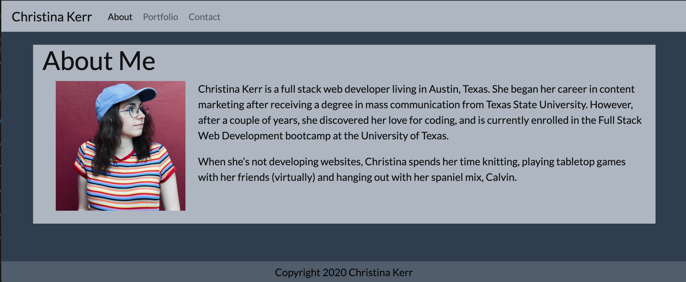

# Responsive Portfolio

## Deployed

[This is the deployed portfolio.](https://christinakerr.github.io/) 

## Purpose

My portfolio is a site for me to show off my work to potential employers. The portfolio placeholder images will be filled in as I work on more projects and gain more experience.

The site is designed to be responsive to different sized screens.

## Tech

This portfolio leverages:
* HTML
* CSS
* Bootstrap grids
* Bootstrap components

